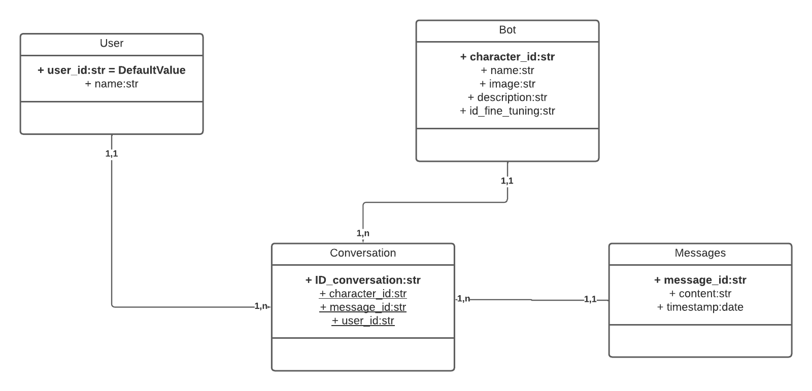

## Chat Intelligent avec Personnages Historiques et Célébrités
Bienvenue sur notre plateforme de chat intelligente, où vous pouvez avoir des conversations captivantes avec des personnages historiques, des célébrités fictives ou même des personnages de films préférés.  

Notre application utilise l'API ChatGPT pour simuler des conversations réalistes et engageantes, offrant une expérience unique et divertissante.

---

## Comment ça marche ?  
Sélectionnez votre Personnage : Parcourez la liste de personnages disponibles et choisissez celui avec lequel vous souhaitez converser. Que ce soit Albert Einstein, Sherlock Holmes, ou votre super-héros préféré, vous avez le choix !

Créez votre Personnage : Vous avez également la possibilité de créer votre propre personnage. Choisissez un nom, ajoutez une photo, et même créez de fausses conversations pour personnaliser l'expérience.

Conversations Réalistes : Commencez la conversation en cliquant sur le personnage de votre choix. L'API ChatGPT générera des réponses réalistes, permettant des échanges dynamiques et intrigants.

-----------
## Schéma de la Base de Données



## Comment exécuter l'Application Localement ?

Pré-requis : Node.js et npm doivent être installés sur votre machine.

```git clone {url}```

```cd TDDexpress && npm install```


Démarrage de l'Application : Exécutez npm start pour lancer l'application. 

```npm run start```

Vous pouvez faire des requetes a l'api

------ 

Auteur  
Ce projet a été créé avec amour par Hedi, Tyhliaux, David, et Noah. N'hésitez pas à contribuer et à nous faire part de vos retours !
